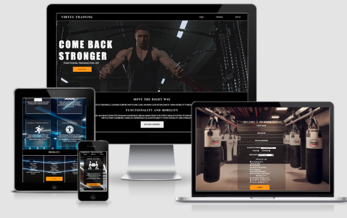
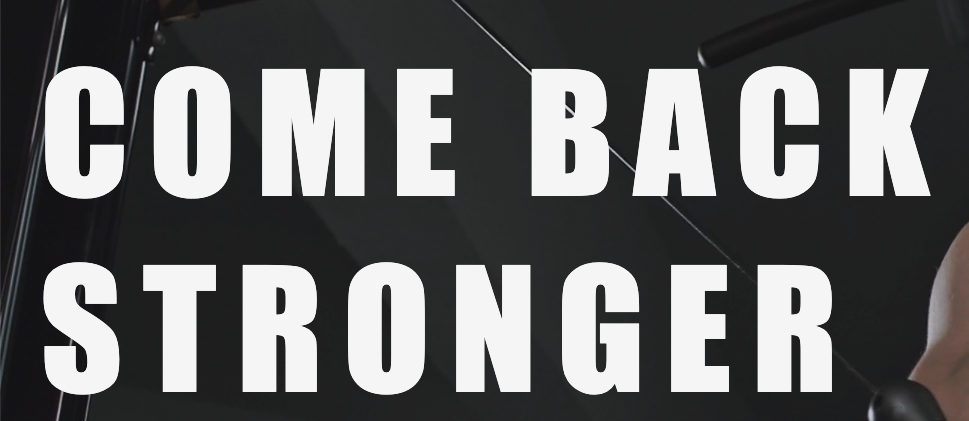
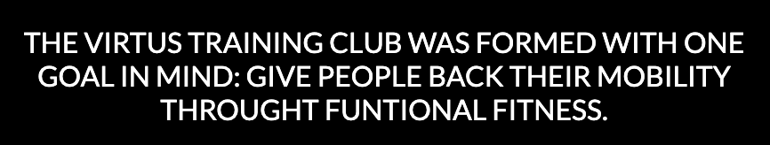
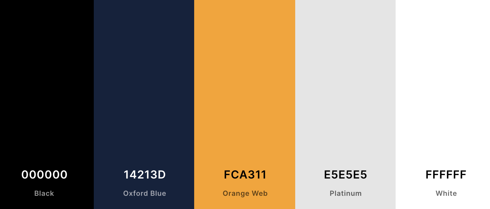
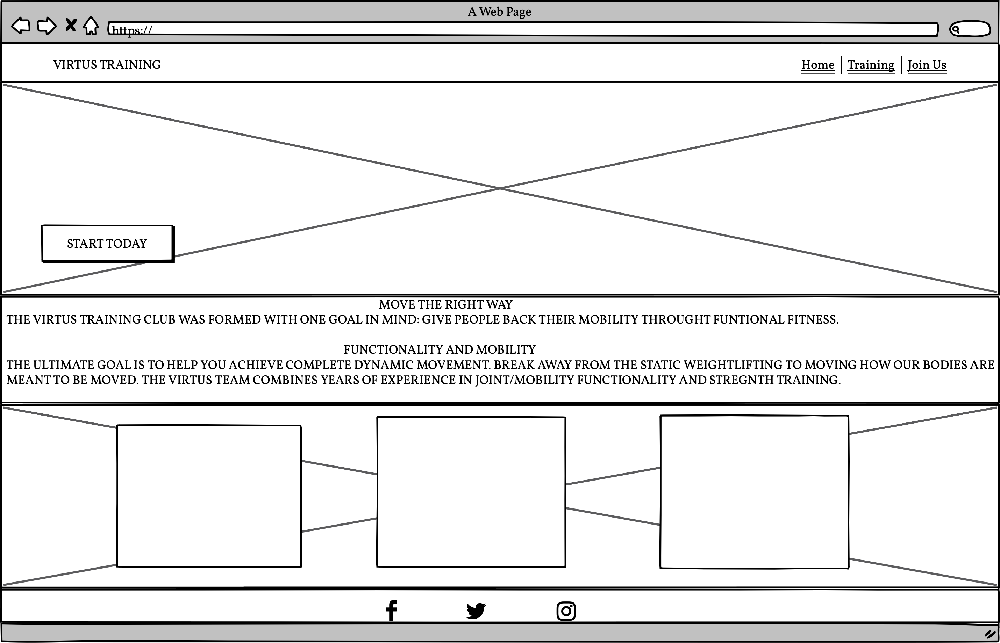
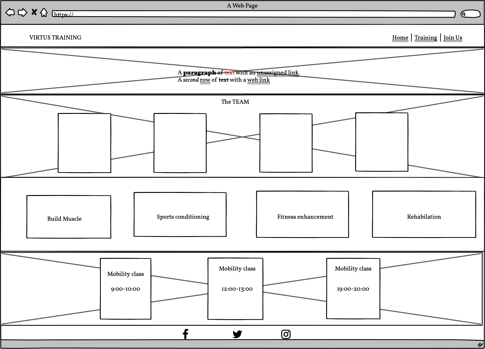
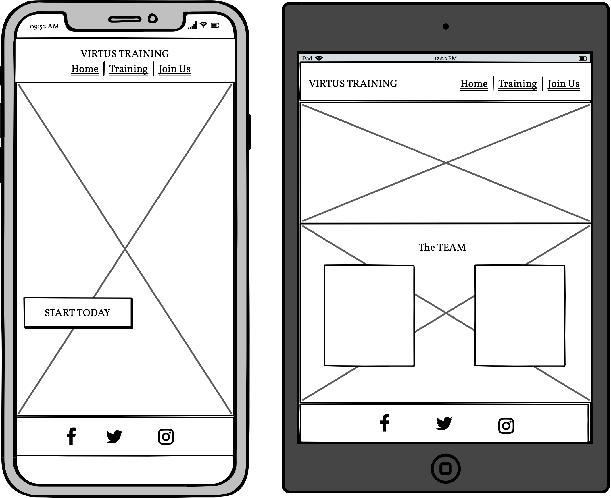

# Virtus Training

* [live link](https://hammad25.github.io/virtus-training-club/) of the project

In this project, I have created a new website for a functional fitness training club in the city of London. The website is designed to encompass the love of fitness with safe practices for healthy joints and overall dynamic mobility that often is lacking in static weight-lifting. The website emphasizes that all the trainers at Virtus are joint/mobility specialists so programs/classes will include fun and challenging dynamic movements.
The site will target those individuals who seek to establish a community of fitness lovers that do not want to compromise on their joint health/mobility in the long run whilst working out. Virtus training will be useful for all users who are new to functional fitness and are looking for more information as well as those fitness enthusiasts looking for a local functional fitness community to be a part of.

## User Stories
* The Website target user is interested in functional fitness and looking to join a local club.
* Should be able to quickly gain an overview of what the training club is about via the landing page.
* Should be able to see who the trainers are that lead the training programs.
* Should be able to see what fitness programs and mobility classes are offered at the training club.
* Should be able to identify what level of experience is required to take a specific class.
* Should be able to get detailed information on times classes are held.
* Should be able to contact the club and make a booking or find out further information.
* Should be able to access social media platforms and engage with the broader community.
     

# Design
## Layout:

* The layout is clean and minimalistic, giving it an elegant high-end user experience. Pops of color to give the website some energy but still, keep in line with the luxury brand. The flow of the pages is well thought out keeping the user experience at the center. 

* The landing page grabs the user's attention, gives brief information on the purpose of the website and its core values.

* The training pages, lays out the trainer's info, programs 
and mobility classes offered then finally moving on to the 
sign up page. 

## Typography
* I used a combination of different styles of font to **emphasize** headings and categories. My main logo font is DM Serif Display. It gives the website a grand theme throughout the user experience.

* the hero video of my website features a bold statement in Arial Narrow Bold to stand out immediately to the user and engage them from the start of the website.

* Any other text that was used throughout the site has a font of 'lato'. I chose this font because it has a minimalistic and modern feel to it.

## Colour Scheme 

*  The site's primary colors are black and white with accents of orange, oxford blue, and platinum. The above image shows the original color section for the site. All colors were picked and matched from [coolors.co](https://coolors.co/).

* The use of these colors was to give the website a luxury high-end feel it while keeping everything minimal and chic and also being readable to all users.

# Wireframes 

* [Balsamiq](https://balsamiq.com/) was used to create the wireframes and here are the primary mock ups.

## Index.html 

* The home page sets the tone for the website. Providing snippets of information while providing buttons to navigate users to other sections of the website for more information.

## Training.html 

* The training page is presented in 4 sections. An overview of what the website offers. 
* A team of trainers is available. The types of functional fitness programs on offer. Lastly, the mobility classes and timings are on offer.
* During development, I decided to display more information on each of the programs offered when the user hovers off the program cards.

## Phone And tablet Devices 

# Features

## Existing features

 #### Navigation Bar
* The Navigation bar consists of 3 links that maintain the integral flow of the website from **Home**, **Training** and finally **Join Us** page.
* It has a black background with sleek white font and when hovered over a link it turns an eye catching orange. When clicked the active page is underlined for enhanced user awareness.
* The Navigation bar is fully responsive and is identical in each page to allow easy navigation on any device.
* The **Home** links directs the user to the top of the *Landing page*
* The **Training** link directs users to the *Training* page which informs the users of your training style, some information about our trainers at the club and the fitness and mobility programs that we offer.
* The **join us** links direct the user to the sign up form to join the training club.

* A further design element of the navbar is that at smaller screen sizes in the navbar scrolls down with the page giving the user extra awareness and flexibility navigating through the site.
* The website along with the navbar maintains a responsive design on smaller devices the website *links* appear below the logo. Visibility and visual aesthetics are maintained keeping the user experience engaged throught out.

#### __Home Page__
* The landing page introduces the user to Virtus Training with 3 sections, 1st with an attention-grabbing video and bold statement and with a call to action button. It sets the tone for the feel of the website; Bold, elite and determined.
* The 2nd section clearly and simplistically tells the user what the main goal for Virtus Training uses a call to action button to help them become a member.

* The 3rd section introduces the user to learn more about the team and the training Virtus offers and different call to actions leading to other parts of the website for a more information
 
 

#### __Training Page__
* The training page provides the user with all the relevant information in order to gain a better understand the mission, the team at virtus and the solutions it offers. Finishing the page with a call to action to join the club.
* The teams section introduces the diverse trainers and their speciality training style in this section. The user can read their bio and get to know them further which establishes a personal connection between the user and the trainer. 
* The program section elaborates for the different training styles offered and allows the user to select the program most suited to them.
* The mobility section is for all mobility and functional movement enthusiasts. This section details different times and skill levels needed to participate in the classes.
 

 

  

### Join us Page
* The Join Us page starts with a motivational statement reinforcing the User to
join Virtus either by completing the membership form or through the contact details provided below the form. A map of the clubs location is also provided to help direct users to the club. 

* The Form will allow the user to become a member of Virtus, in the capacity they see fit. The personal details on the form are required for the form completion. Users however have the option to either opt for the training program or a mobility class or choose both if they wish. Once submitted the user is taken to the **Thank you** page.

  

### Thank you Page

* The thank you page is confirmation of submitting the join us form. It confirms to the user Virtus has received their form and a member of the Virtus club will get in touch with them via the contact details the user has provided. 
* The thank you page has the same layout of the navigation bar and club details and map to maintain user experince and if hey wish to navigate back to the site they are able to.

  

### Footer

* The footer contains the social media links to Virtus, if the user wants to see or engage with Virtus on any of its social media platforms. The social media links open on a new browser window and are displayed thought out all pages to allow users access at any point of their Virtus journey. The social media icons turn orange when hovered over them for better user accessibility.

  

## Future Features

* Virtus would like to expand its mobility classes so a self online booking page where users can see which classes have availability and book a spot.

* A subscribe pop up section where new users can enter their emails and sign up for the latest classes, programs and club updates

* A Journal section with all the latest joint/mobility workouts, lifestyle, and nutrition recipies.

## Technology
*  [HTML:](https://www.w3.org/html/)  - HTMl5 provided the content and the structure for the project. HTML was used to build the UI.

* [CSS:](https://www.w3.org/Style/CSS/) - CSS was used to style.CSS was used to manage the UI.

* [Git](https://git-scm.com/) - Git was used to managing the code. Allowing me to create backups whenever significant changes were made to code by utilizing the gitpod terminal to commit to Git and Push to GitHub.

* [GitHub:](https://github.com/) - GitHub was used to externally store repository and site deployment.

## Testing
Throughout this project, I have carried out regular testing. Through live server and Chrome deverloper tools I was 
continuously able to test the websit accessibility. 

#### Testing the links
* Testing all internal links connected to different pages of the website **Home**, **Training** and **Join us**.
* Testing external links, the social media links whether they were indeed opening in new browser windows.

#### Testing the Form
* Testing to see all required fields were required for form submission. An error would appear if e.g Name was not entered or the correct telephone number patterns were not entered. T
* Testing the Submit button.

  

#### Testing Navbar
* Testing fixed navbar for smaller decvies i.e Iphone

 

### Code Validation
* HTML validating was done in [W3C Validator](https://validator.w3.org/)
* No errors were returned when passing through the official W3C HTML validator .
   * [index.html Validation](/documentation/readme-index.html-validation.png)
   * [training.html Validation](/documentation/readme-training.html-validation.png)
   * [joinus.html Validation](/documentation/readme-joinus.html-validation.png)
   * [thankyou.html Validation](/documentation/readme-thankyou.html-validation.png)
    
* CSS Validating was done in [CSS Validator](https://jigsaw.w3.org/css-validator/)
* No errors were returned.
   * [CSS Validation](/documentation/readme-CSS-validator.png)

### Lighthouse
  

#### Test case
* I featured the website landing page on various interactive platforms and all involved users after access the landing page concluded this website clearly demonstrates a training club giving a functional approach to fitness and prioritizing joint/mobility health.

 

 ### Fixed bugs
 * I encountered a "The element button must not appear as a descendant of the a element." error message when running HTML validation. 
 * To solve this issue I replaced the a element with a form element.

 #### Supported Screen and browsers
 * I tested the site responsiveness by using Dev tools in **Chrome Simulator** 
 * The primary smaller device sizes that were tested for were Ipad, Iphone X.

## Deployment
#### Via gitpod
* In the terminal command line "python3 -m http.server" then click open browser.

#### Via github pages
* The site was deployed to GitHub pages. The steps taken to deploy are as follows:
* In the GitHub repository, Settings tab; source section drop-down menu, select the Master Branch.
* The live link can be found here -  https://hammad25.github.io/virtus-training-club/

## Credits 
* Thanks to Rohit Sharma, my mentor for his guidance, industry insights, and reassurance through the process and pointing me in the right direction.
* The Slack community for support and feedback was invaluable.
* Balsamiq was used to create the wireframes.
* The Code institute love running and [Mozilla](https://developer.mozilla.org/en-US/docs/Web/CSS/grid-template-columns) helped me with my code.
* [Coolors](https://coolors.co/) - Used to create my colour palette.
* [font Awesome](https://fontawesome.com/) for the variours icons.

#### Content
* The text was taken from various fitness websites and articles [Functional fitness](https://www.opexfit.com/blog/what-is-functional-fitness)

* The icons in the footer were taken from [Font Awesome](https://fontawesome.com/)

### Media
* The photos/video used were taken from [pexels](https://www.pexels.com/) and [Google](https://www.google.com/search?q=luxury+gyms+images&rlz=1C5CHFA_enGB949GB949&hl=en&sxsrf=AOaemvKQmSRGrtQp-nlBnFiE_Z4DZrso4g:1634747574800&source=lnms&tbm=isch&sa=X&ved=2ahUKEwjVjPijtdnzAhUAgf0HHbVRCdIQ_AUoAXoECAEQAw&biw=1537&bih=868&dpr=1#imgrc=GJfrqxLniaVpfM)

 

